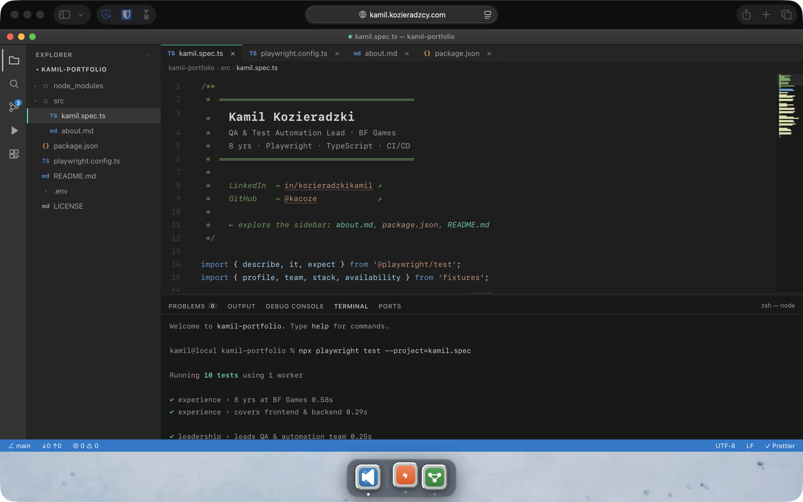

# vsc-portfolio

[](https://github.com/Kacoze/kamil-card/actions/workflows/ci.yml)

Portfolio site styled as a VS Code workspace — open the files from the sidebar.

**Live:** [kamil.kozieradzcy.com](https://kamil.kozieradzcy.com)



## Concept

The site simulates a VS Code environment: a window manager, an editor with multiple files, a working terminal, a Postman-style contact form, and a GitHub Actions panel. Everything runs in the browser with no backend.

## Stack

- **Vite 6** + TypeScript (no framework)
- **Playwright** — E2E + Lighthouse audits
- **Vitest** — unit tests
- **Cloudflare Pages** — hosting

## Dev

```bash
npm install
npm run dev         # localhost:5173
npm run build       # dist/
npm run test        # vitest
npm run test:e2e    # playwright
```

## Tests

```
tests/
  e2e/
    editor.spec.ts      — file switching, terminal, source control
    wm.spec.ts          — window manager (minimize/maximize/close/resize)
    postman.spec.ts     — contact form validation and submission
    actions.spec.ts     — CI jobs panel
    sidebar.spec.ts     — sidebar navigation, breadcrumbs
    content.spec.ts     — editor content assertions
    tabs.spec.ts        — tab management
    terminal.spec.ts    — all terminal commands
    run-panel.spec.ts   — Run & Debug panel
    search.spec.ts      — file search
    dock.spec.ts        — dock icons and animations
    mobile.spec.ts      — mobile layout
    lighthouse.spec.ts  — 100/100 Lighthouse (desktop + mobile)
  unit/
    editor.test.ts      — terminal REPL, file switching, history
    wm.test.ts          — window state, close/minimize/restore
    postman.test.ts     — form validation, tab switching, fetch mock
    actions.test.ts     — CI job toggle, rerun animation
    reveal.test.ts      — terminal reveal timing
    terminal.test.ts    — command parsing edge cases
    utils.test.ts       — esc(), clamp(), parseTerminalCommand()
```
